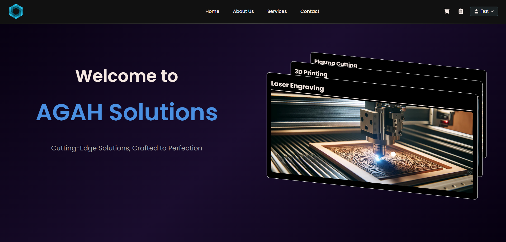
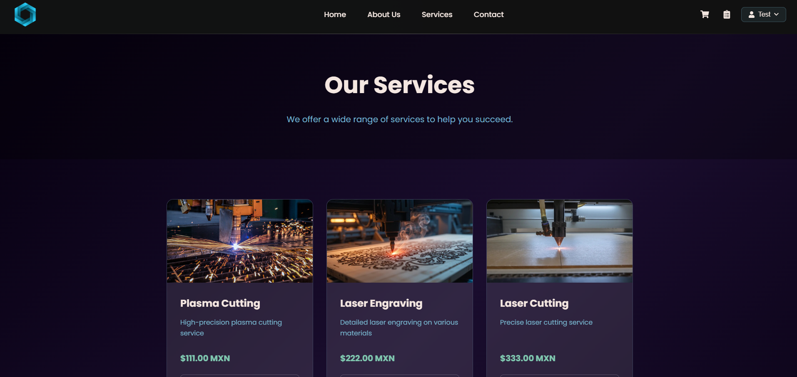
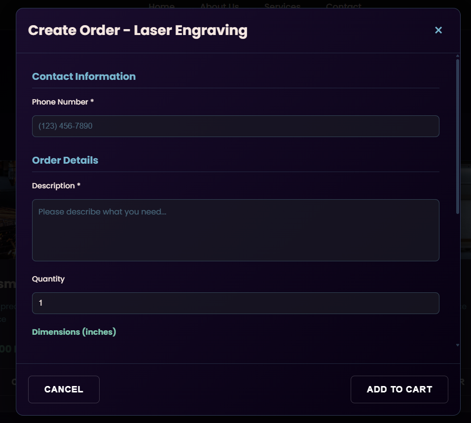
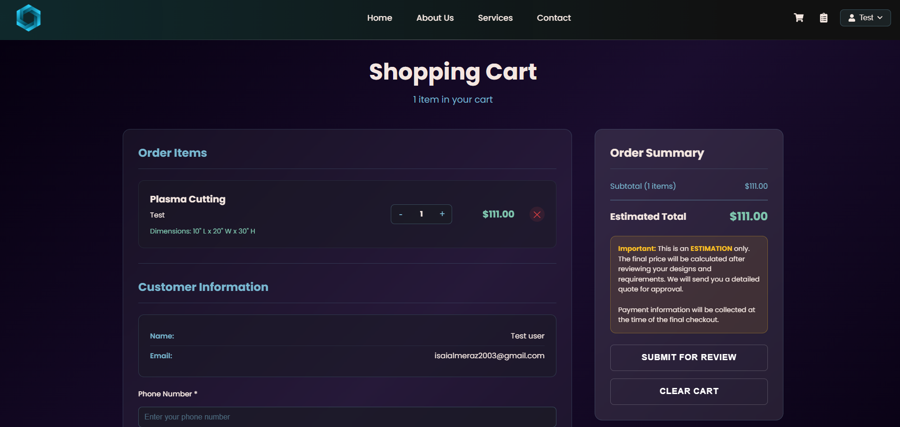
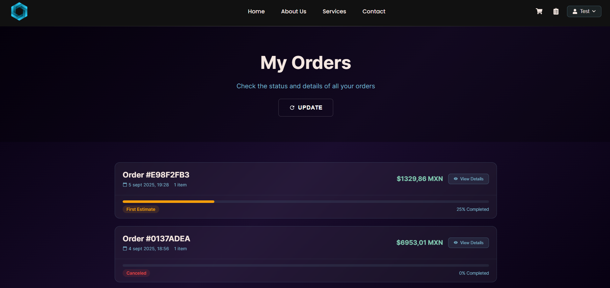
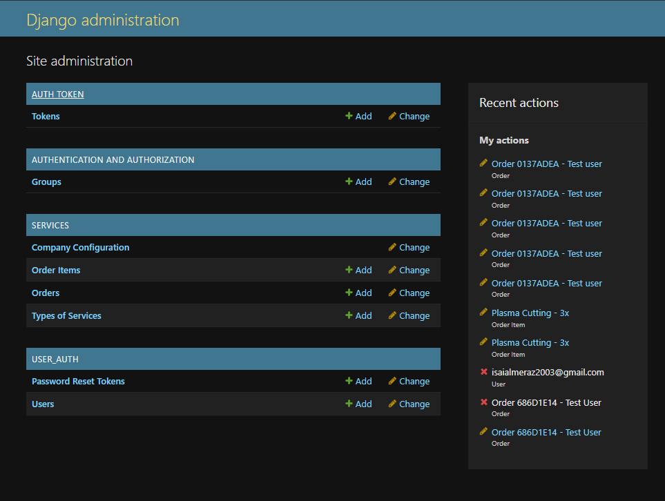
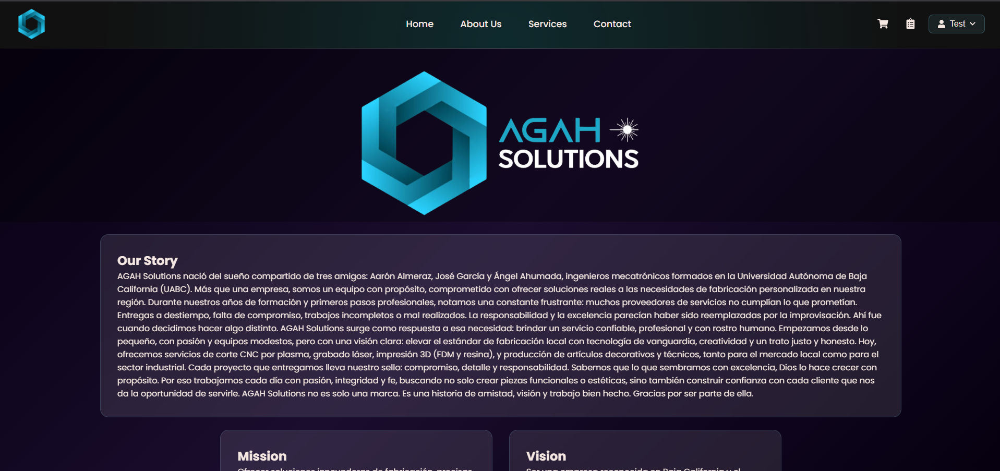
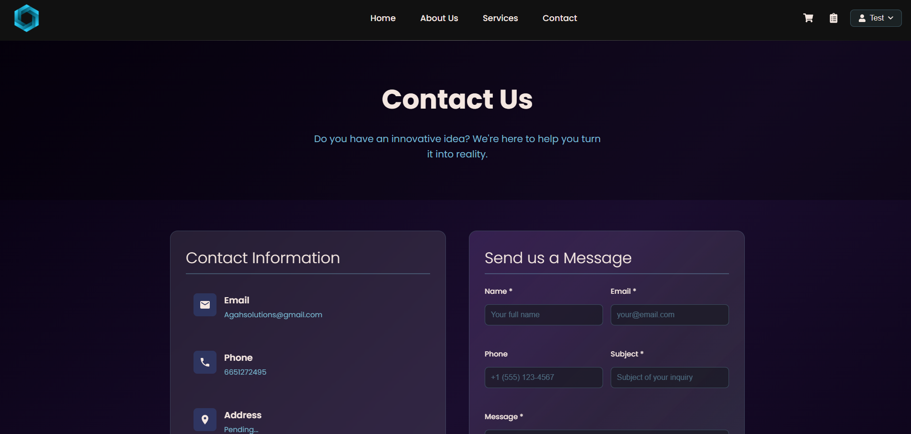

# AGAH Solutions - Aplicación Full Stack

## Descripción General

Sistema completo de gestión de servicios para AGAH Solutions, permitiendo a los clientes solicitar cotizaciones de servicios de fabricación especializada (láser, plasma, router CNC), gestionar pedidos y contactar con la empresa.

## Tecnologías Utilizadas

### Backend
- **Django 5.2** - Framework principal
- **Django REST Framework** - APIs RESTful
- **SQLite** - Base de datos (desarrollo)
- **Token Authentication** - Autenticación basada en tokens
- **SMTP Gmail** - Envío de correos electrónicos

### Frontend
- **React 19.1** - Framework de UI
- **React Router DOM** - Navegación
- **Axios** - Cliente HTTP
- **Three.js** - Gráficos 3D
- **GSAP** - Animaciones
- **Vite** - Herramienta de construcción

## Requisitos Previos

- Python 3.8+
- Node.js 18+
- npm o yarn
- Cuenta de Gmail con contraseña de aplicación para emails

## Instalación y Configuración

### Backend (Django)

1. **Clonar el repositorio y navegar al backend**
```bash
cd backend
```

2. **Crear entorno virtual**
```bash
# Crear entorno
python -m venv venv

# Activar entorno virtual:
# Linux/Mac:
source venv/bin/activate

# Windows (PowerShell):
venv\Scripts\Activate.ps1

# Windows (Command Prompt):
venv\Scripts\activate.bat
```

3. **Instalar dependencias**
```bash
pip install django djangorestframework django-cors-headers python-dotenv pillow
```

4. **Configurar variables de entorno**
Crear archivo `.env` en la carpeta backend:
```env
SECRET_KEY=tu-django-secret-key-aqui
DEBUG=True
ALLOWED_HOSTS=localhost,127.0.0.1

# Configuración de Email
EMAIL_HOST=smtp.gmail.com
EMAIL_PORT=587
EMAIL_USE_TLS=True
EMAIL_HOST_USER=tu-email@gmail.com
EMAIL_HOST_PASSWORD=tu-app-password
DEFAULT_FROM_EMAIL=AGAH Solutions <tu-email@gmail.com>
CONTACT_EMAIL=tu-email@gmail.com

# URLs
FRONTEND_URL=http://localhost:3000
API_BASE_URL=http://localhost:8000
CORS_ALLOWED_ORIGINS=http://localhost:3000,http://localhost:5173
```

5. **Ejecutar migraciones**
```bash
python manage.py makemigrations
python manage.py migrate
```

6. **Crear superusuario**
```bash
python manage.py createsuperuser
```

7. **Iniciar servidor**
```bash
python manage.py runserver
```

### Frontend (React)

1. **Navegar a la carpeta frontend**
```bash
cd frontend
```

2. **Instalar dependencias**
```bash
# Con npm:
npm install

# Con yarn:
yarn install
```

3. **Configurar API URL**
En `src/services/api.js`, verificar que la URL base apunte al backend:
```javascript
baseURL: 'http://localhost:8000'
```

4. **Iniciar servidor de desarrollo**
```bash
# Con npm:
npm run dev

# Con yarn:
yarn dev
```

La aplicación estará disponible en `http://localhost:5173`

## Estructura del Proyecto

```
proyecto/
├── backend/
│   ├── config/         # Configuración principal Django
│   ├── services/       # App principal (modelos, vistas, APIs)
│   ├── user_auth/      # App de autenticación
│   ├── templates/      # Templates de email
│   ├── media/          # Archivos subidos
│   └── manage.py
│
└── frontend/
    ├── src/
    │   ├── components/  # Componentes React
    │   ├── pages/       # Páginas principales
    │   ├── services/    # APIs y servicios
    │   ├── context/     # Context API (autenticación)
    │   └── App.jsx
    └── package.json
```

## Autenticación y Autorización

### Sistema de Autenticación

La aplicación utiliza **Token Authentication** de Django REST Framework:

1. **Login**: El usuario envía credenciales, recibe un token
2. **Almacenamiento**: Token guardado en localStorage
3. **Peticiones**: Token incluido en header `Authorization: Token {token}`
4. **Logout**: Token eliminado del cliente y servidor

### Tipos de Usuario

- **Customer**: Usuario regular, puede crear pedidos
- **Staff/Admin**: Acceso al panel de administración

### Flujo de Autenticación

```javascript
// Iniciar sesión
POST /api/auth/login/
Body: { username, password }
Response: { token, user }

// Verificar estado
GET /api/auth/status/
Headers: Authorization: Token {token}

// Cerrar sesión
POST /api/auth/logout/
Headers: Authorization: Token {token}
```

## APIs Principales

### Servicios
- `GET /api/services/` - Lista de servicios disponibles
- `GET /api/services/{type}/` - Detalle de servicio

### Órdenes
- `POST /api/orders/create/` - Crear nuevo pedido
- `GET /api/orders/customer/?email={email}` - Órdenes por cliente
- `GET /api/orders/track/{order_number}/` - Seguimiento

### Contacto
- `POST /api/contact/` - Enviar formulario de contacto

### Compañía
- `GET /api/company/` - Información de la empresa

## Flujo de Trabajo de Pedidos

1. **Cliente crea pedido** → Estado: `pending`
2. **Admin revisa y estima** → Estado: `estimated`
3. **Cliente confirma** → Estado: `confirmed`
4. **Trabajo en progreso** → Estado: `in_progress`
5. **Pedido completado** → Estado: `completed`

## Panel de Administración

Acceder en `http://localhost:8000/admin/`

### Funcionalidades:
- Gestión de servicios y precios
- Revisión y actualización de pedidos
- Configuración de empresa
- Gestión de usuarios

## Envío de Correos

La aplicación envía correos automáticos en:
- Confirmación de pedido nuevo
- Actualización de precio estimado
- Precio final disponible
- Pedido completado
- Formulario de contacto recibido

## Solución de Problemas Comunes

### Error de CORS
Verificar que `CORS_ALLOWED_ORIGINS` incluya la URL del frontend

### Los emails no se envían
1. Verificar configuración SMTP en `.env`
2. Usar contraseña de aplicación de Gmail, no la contraseña regular
3. Revisar logs en `backend/logs/django.log`

### Token no válido
Limpiar localStorage y hacer login nuevamente

## Comandos Útiles

**Backend**
```bash
# Crear migraciones
python manage.py makemigrations

# Aplicar migraciones
python manage.py migrate

# Shell interactivo Django
python manage.py shell

# Ejecutar pruebas
python manage.py test

# Crear superusuario
python manage.py createsuperuser

# Recolectar archivos estáticos (producción)
python manage.py collectstatic
```

**Frontend**
```bash
# Instalar dependencias
npm install        # o: yarn install

# Servidor de desarrollo
npm run dev        # o: yarn dev

# Construir para producción
npm run build      # o: yarn build

# Previsualizar construcción
npm run preview    # o: yarn preview

# Ejecutar linter
npm run lint       # o: yarn lint
```

## Capturas de Pantalla

### Página de Inicio


### Servicios


### Modal de Pedido


### Carrito


### Pedidos


### Panel de Administración


### Acerca de Nosotros


### Contáctanos
