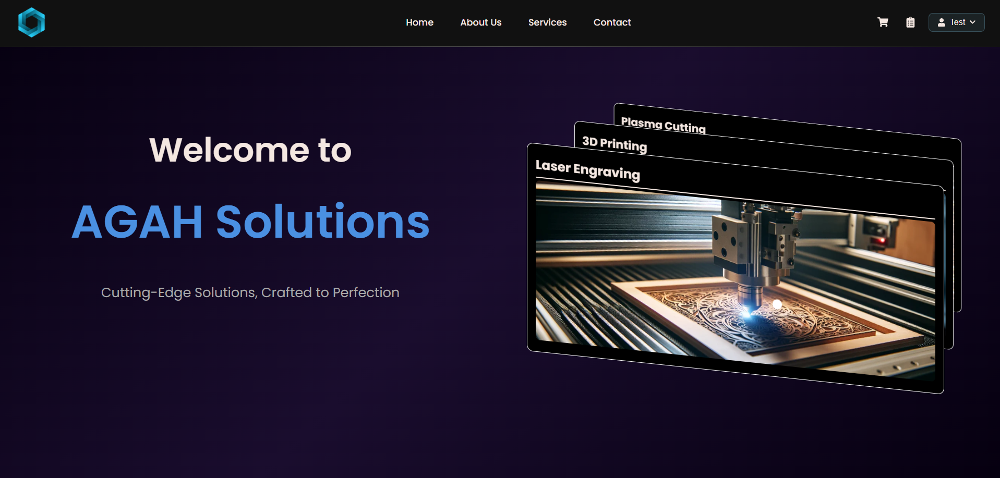
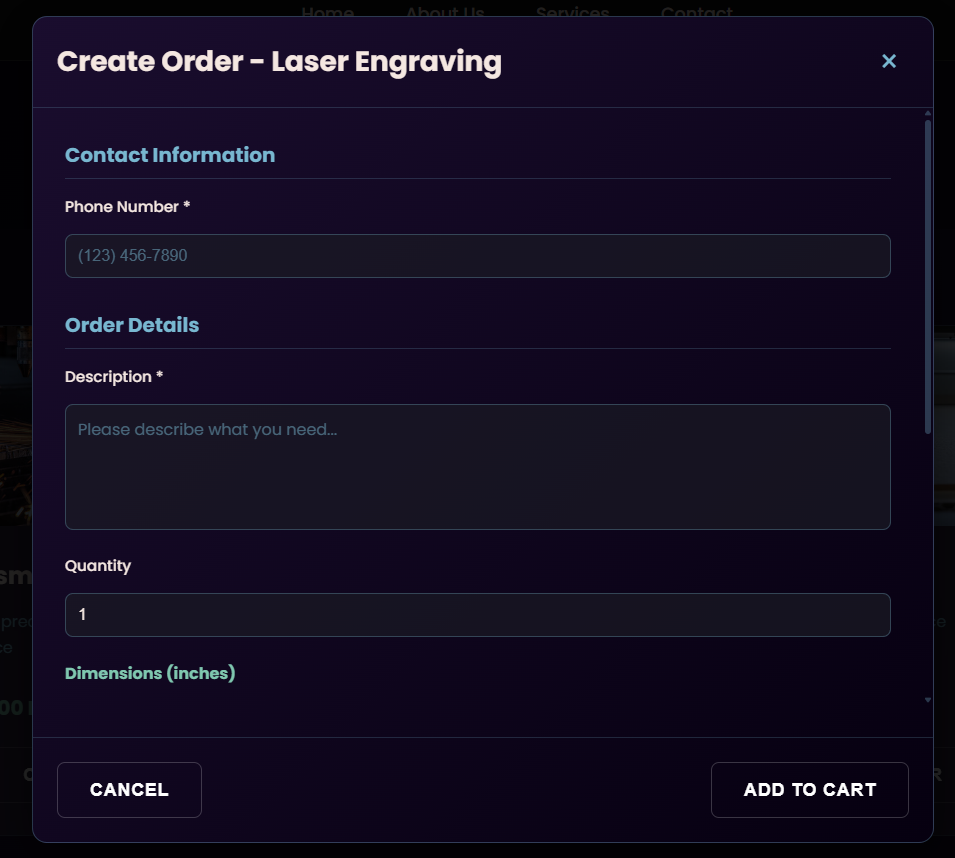
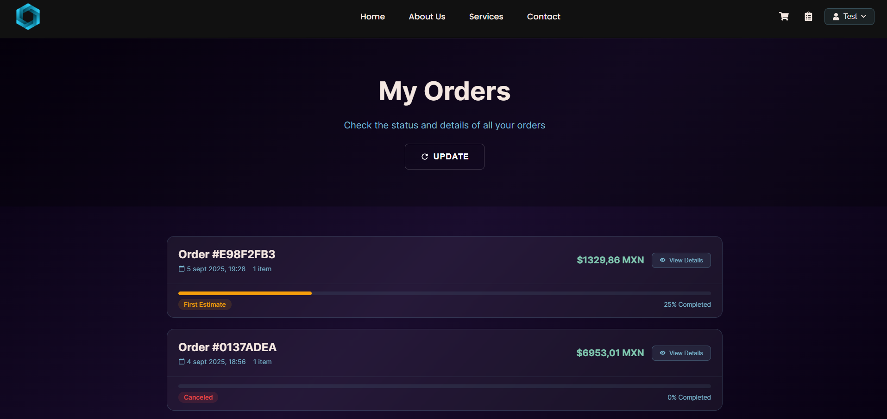
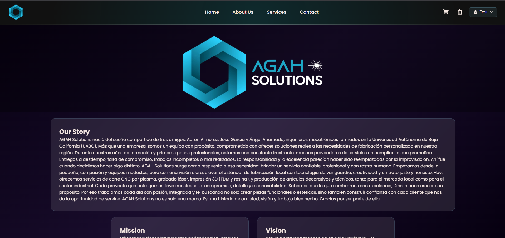

# AGAH Solutions - Full Stack Application

## Overview

Complete service management system for AGAH Solutions, allowing customers to request quotes for specialized manufacturing services (laser, plasma, CNC router), manage orders and contact the company.

## Technologies Used

### Backend
- **Django 5.2** - Main framework
- **Django REST Framework** - RESTful APIs
- **SQLite** - Database (development)
- **Token Authentication** - Token-based authentication
- **SMTP Gmail** - Email sending

### Frontend
- **React 19.1** - UI Framework
- **React Router DOM** - Navigation
- **Axios** - HTTP client
- **Three.js** - 3D graphics
- **GSAP** - Animations
- **Vite** - Build tool

## Prerequisites

- Python 3.8+
- Node.js 18+
- npm or yarn
- Gmail account with app password for emails

## Installation and Setup

### Backend (Django)

1. **Clone repository and navigate to backend**
```bash
cd backend
```

2. **Create virtual environment**
```bash
# Create environment
python -m venv venv

# Activate virtual environment:
# Linux/Mac:
source venv/bin/activate

# Windows (PowerShell):
venv\Scripts\Activate.ps1

# Windows (Command Prompt):
venv\Scripts\activate.bat
```

3. **Install dependencies**
```bash
pip install django djangorestframework django-cors-headers python-dotenv pillow
```

4. **Configure environment variables**
Create `.env` file in backend folder:
```env
SECRET_KEY=your-django-secret-key-here
DEBUG=True
ALLOWED_HOSTS=localhost,127.0.0.1

# Email Configuration
EMAIL_HOST=smtp.gmail.com
EMAIL_PORT=587
EMAIL_USE_TLS=True
EMAIL_HOST_USER=your-email@gmail.com
EMAIL_HOST_PASSWORD=your-app-password
DEFAULT_FROM_EMAIL=AGAH Solutions <your-email@gmail.com>
CONTACT_EMAIL=your-email@gmail.com

# URLs
FRONTEND_URL=http://localhost:3000
API_BASE_URL=http://localhost:8000
CORS_ALLOWED_ORIGINS=http://localhost:3000,http://localhost:5173
```

5. **Run migrations**
```bash
python manage.py makemigrations
python manage.py migrate
```

6. **Create superuser**
```bash
python manage.py createsuperuser
```

7. **Start server**
```bash
python manage.py runserver
```

### Frontend (React)

1. **Navigate to frontend folder**
```bash
cd frontend
```

2. **Install dependencies**
```bash
# With npm:
npm install

# With yarn:
yarn install
```

3. **Configure API URL**
In `src/services/api.js`, verify base URL points to backend:
```javascript
baseURL: 'http://localhost:8000'
```

4. **Start development server**
```bash
# With npm:
npm run dev

# With yarn:
yarn dev
```

Application will be available at `http://localhost:5173`

## Project Structure

```
project/
├── backend/
│   ├── config/         # Django main configuration
│   ├── services/       # Main app (models, views, APIs)
│   ├── user_auth/      # Authentication app
│   ├── templates/      # Email templates
│   ├── media/          # Uploaded files
│   └── manage.py
│
└── frontend/
    ├── src/
    │   ├── components/  # React components
    │   ├── pages/       # Main pages
    │   ├── services/    # APIs and services
    │   ├── context/     # Context API (authentication)
    │   └── App.jsx
    └── package.json
```

## Authentication and Authorization

### Authentication System

The application uses Django REST Framework's **Token Authentication**:

1. **Login**: User sends credentials, receives token
2. **Storage**: Token stored in localStorage
3. **Requests**: Token included in header `Authorization: Token {token}`
4. **Logout**: Token removed from client and server

### User Types

- **Customer**: Regular user, can create orders
- **Staff/Admin**: Access to admin panel

### Authentication Flow

```javascript
// Login
POST /api/auth/login/
Body: { username, password }
Response: { token, user }

// Check status
GET /api/auth/status/
Headers: Authorization: Token {token}

// Logout
POST /api/auth/logout/
Headers: Authorization: Token {token}
```

## Main APIs

### Services
- `GET /api/services/` - List of available services
- `GET /api/services/{type}/` - Service detail

### Orders
- `POST /api/orders/create/` - Create new order
- `GET /api/orders/customer/?email={email}` - Orders by customer
- `GET /api/orders/track/{order_number}/` - Tracking

### Contact
- `POST /api/contact/` - Send contact form

### Company
- `GET /api/company/` - Company information

## Order Workflow

1. **Customer creates order** → Status: `pending`
2. **Admin reviews and estimates** → Status: `estimated`
3. **Customer confirms** → Status: `confirmed`
4. **Work in progress** → Status: `in_progress`
5. **Order completed** → Status: `completed`

## Admin Panel

Access at `http://localhost:8000/admin/`

### Features:
- Service and price management
- Order review and update
- Company configuration
- User management

## Email Sending

The application sends automatic emails for:
- New order confirmation
- Estimated price update
- Final price available
- Order completed
- Contact form received

## Common Troubleshooting

### CORS Error
Verify `CORS_ALLOWED_ORIGINS` includes frontend URL

### Emails not sending
1. Check SMTP configuration in `.env`
2. Use Gmail app password, not regular password
3. Check logs in `backend/logs/django.log`

### Invalid token
Clear localStorage and login again

## Useful Commands

**Backend**
```bash
# Create migrations
python manage.py makemigrations

# Apply migrations
python manage.py migrate

# Django interactive shell
python manage.py shell

# Run tests
python manage.py test

# Create superuser
python manage.py createsuperuser

# Collect static files (production)
python manage.py collectstatic
```

**Frontend**
```bash
# Install dependencies
npm install        # or: yarn install

# Development server
npm run dev        # or: yarn dev

# Production build
npm run build      # or: yarn build

# Preview build
npm run preview    # or: yarn preview

# Run linter
npm run lint       # or: yarn lint
```

## Screenshots

### Homepage


### Services


### Order Modal


### Cart


### Orders


### Admin Panel


### About Us


### Contact Us
